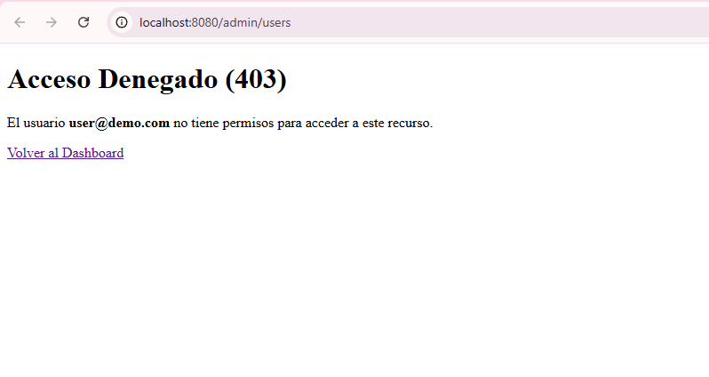
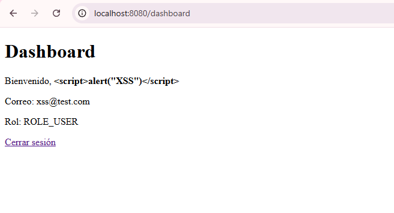
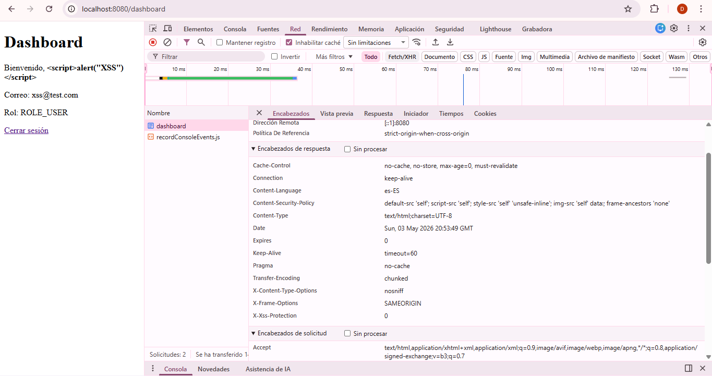
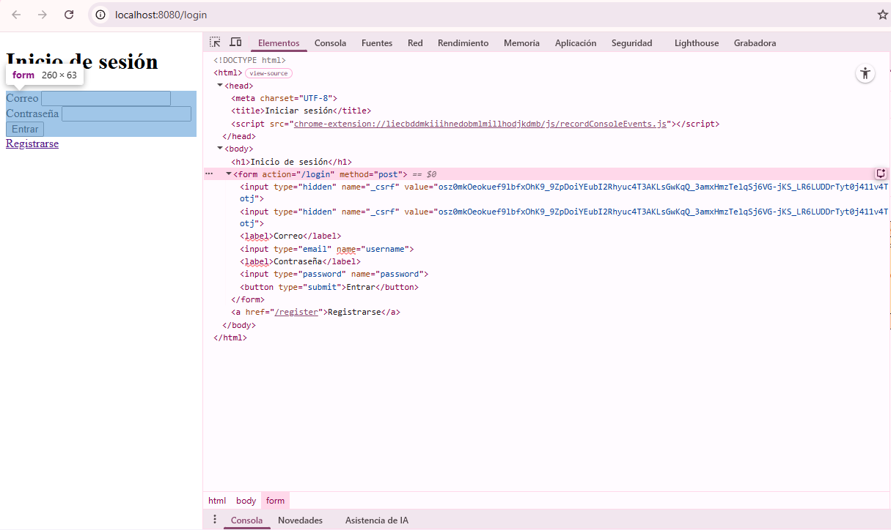
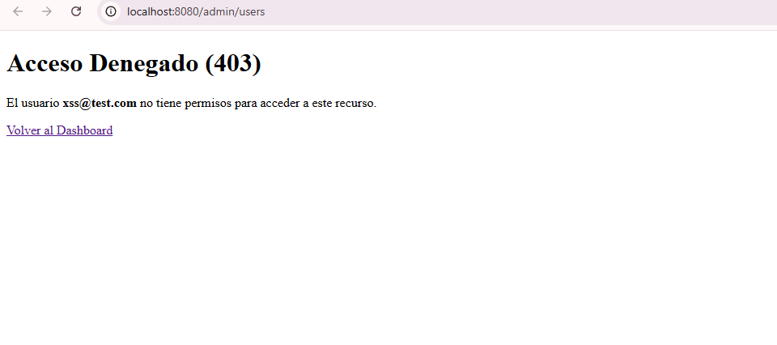

# Unidad 9 - Seguridad en Aplicaciones Web

Proyecto demostrativo que implementa la base del Post-Contenido 1 y las verificaciones del Post-Contenido 2.

## Incluye
- Registro de usuarios con contraseña cifrada.
- Login con `UserDetailsService` contra la base de datos.
- Roles `ADMIN` y `USER`.
- Autorización a nivel de método con `@PreAuthorize`.
- Página personalizada de error 403.
- Mitigación de XSS con `th:text`.
- Política CSP básica.
- CSRF activo por defecto.

## Datos de acceso
- Admin: `admin@demo.com` / `admin123`
- Usuario: `user@demo.com` / `user123`

## Pruebas de seguridad

### 1. `@PreAuthorize` y página 403
1. Inicia sesión con `user@demo.com`.
2. Entra a `/admin/users`.
3. El resultado esperado es `403` con la vista personalizada `error/403.html`.

### 2. XSS
1. Registra un usuario con nombre ``.
2. Entra al dashboard con esa cuenta.
3. El navegador debe mostrar el texto literal y no ejecutar el script, porque la vista usa `th:text`.

### 3. CSP
1. Abre DevTools en la pestaña Network.
2. Carga `/dashboard`.
3. Verifica que la respuesta incluya la cabecera `Content-Security-Policy`.

### 4. CSRF
1. Con una sesión iniciada, ejecuta `POST /logout` sin token CSRF.
2. El servidor debe responder `403 Forbidden`.

### 5. Panel de Administración

